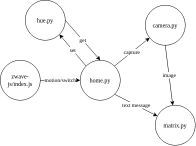

# Low Profile/Effort Automation
- Runs on an RPI2
- Multi-process queue architecture
- Python and NodeJS

# Requirements
Each process is independent and can be re-written according to the
hardware available. Everything is configured in the code.

For bluetooth:
- a bluetooth adapter
- bluez configured and enabled

For zwave:
- a zwave-js compatible ZWave dongle

# Set-up
Example systemd service units are provided and should be edited before use.
Executing each process individually by some other means is equally valid.
Print statements have been removed to reduce the size of systemd journal
logs.
Debugging IPC can be done through mosquitto itself: ```mosquitto_sub -v -t /#```.

# Architecture
All processes achieve IPC through MQTT via the Mosquitto MQTT server.


